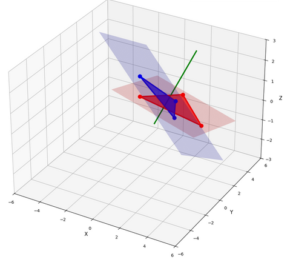
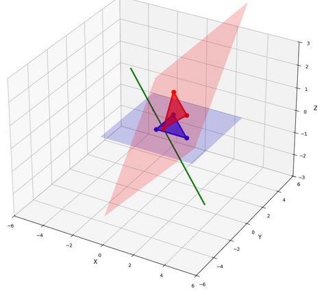
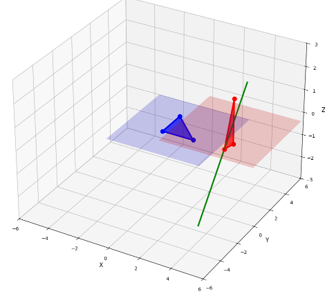
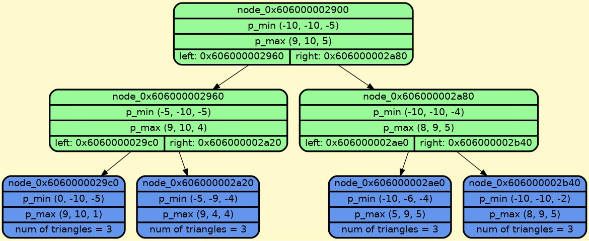

<div align="center">

  # Решение задачи о пересечении треугольников на C++
  
  
  

</div>

## Другие языки

1. [Русский](/README-R.md)
2. [English](/README.md)

## Содержание
- [1. Установка и сборка](#установка-и-сборка)
- [2. Введение](#введение)
- [3. Реализация алгоритма](#реализация-алгоритма)
- [4. Структура данных для ускорения](#структура-данных-для-ускорения)
- [5. Структура проекта](#структура-проекта)
- [6. Требования](#требования)
- [7. Авторы проекта](#авторы-проекта)

## Установка и сборка

Чтобы установить, скомпилировать и запустить проект, выполните:
```bash
git clone https://github.com/BulgakovDmitry/3D_triangles
cd 3D_triangles
cmake -S . -B build -DCMAKE_BUILD_TYPE=Release
cd build
cmake --build .
./3D_triangles
```

Чтобы запустить unit тесты, выполните:
```bash
ctest
```

Либо без ctest:
```bash
make unit
```

Или по отдельности:
```bash
ctest -L intersection
ctest -L primitives
ctest -L BVH
```

Чтобы запустить end_to_end тесты, выполните:
```bash
make end_to_end
```

Для сборки в режиме отладки (Debug), выполните:
```bash
cmake -S . -B build -DCMAKE_BUILD_TYPE=Debug
cd build
cmake --build .
./3D_triangles
```

## Введение
Этот проект на `C++` реализует программу для работы с треугольниками в трёхмерном пространстве. Основной функционал включает надёжные алгоритмы вычисления геометрических свойств и обнаружения пересечений между треугольниками.

Разработка подобных инструментов геометрической обработки имеет высокий практический потенциал, поскольку они составляют фундаментальный слой для широкого круга критически важных приложений. Среди них — обнаружение столкновений в физических движках для видеоигр и симуляций, 3D‑моделирование и системы автоматизированного проектирования (`CAD`), трассировка лучей в компьютерной графике, а также задачи навигации в робототехнике. Поэтому эффективная и точная работа с треугольниками является ключевой для прогресса в этих технологически значимых областях.

## Реализация алгоритма
### Шаг 1: Проверка треугольника `T1` относительно плоскости `π₂`
Вычисляются три предиката `orient_3d`, определяющие расположение вершин `T1` относительно плоскости `π₂`, задаваемой треугольником `T2`. Если все вершины строго по одну сторону плоскости — пересечения нет. Если все три предиката равны нулю, треугольники компланарны и задача сводится к проверке пересечения в `2D`. В противном случае алгоритм продолжается.

<table>
  <tr>
    <td align="center">
      
      <br>
      <em>Рис. 1. Стандартный случай пересечения треугольников по линии пересечения плоскостей. Линия пересечения плоскостей показана зелёным, области, в которых лежат соответствующие треугольники, — синим и красным.</em>
    </td>
    <td align="center">
      
      <br>
      <em>Рис. 2. Пересечение треугольников в одной вершине. Линия пересечения плоскостей показана зелёным, области, в которых лежат соответствующие треугольники, — синим и красным.</em>
    </td>
  </tr>
</table>

<table>
  <tr>
    <td align="center">
      
      <br>
      <em>Рис. 3. Параллельный случай — пересечения нет. Области, в которых лежат соответствующие треугольники, показаны синим и красным.</em>
    </td>
    <td align="center">
      
      <br>
      <em>Рис. 4. Пересечения нет. Красный треугольник пересекает плоскость синего в одной вершине.</em>
    </td>
  </tr>
</table>

### Шаг 2: Проверка треугольника `T2` относительно плоскости `π₁`
Аналогично вычисляются три предиката `orient_3d`, определяющие расположение вершин `T2` относительно плоскости `π₁`, задаваемой `T1`. Если все вершины по одну сторону — пересечения нет. Если все предикаты равны нулю — треугольники компланарны (`2D`‑случай). Если этот шаг пройден, оба треугольника гарантированно пересекают линию пересечения (`L`) своих плоскостей.

### Шаг 3: Канонический порядок вершин
Вершины каждого треугольника переупорядочиваются для получения канонической конфигурации. Для каждого треугольника требуется, чтобы одна вершина (P) находилась по одну сторону плоскости другого треугольника, а две остальные (`Q` и `R`) — по другую. Это гарантирует, что рёбра `P‑Q` и `P‑R` пересекают плоскость, задавая отрезок на линии `L`.

### Шаг 4: Проверка пересечения интервалов с помощью предикатов
Перекрытие двух отрезков на линии `L` определяется вычислением двух предикатов ориентации: `orient_3d(P₁, Q₁, P₂, Q₂) > 0` и `orient_3d(P₁, R₁, R₂, P₂) > 0`. Если оба условия истинны, отрезки перекрываются, что означает пересечение треугольников.

### Функция проверки пересечения треугольников
Алгоритм проверки пересечения треугольников в трёхмерном пространстве реализован следующим образом:
<details>
<summary>Показать/скрыть код</summary>

```cpp
inline bool intersect(const Triangle &first, const Triangle &second) {
    if (first.get_type() == TypeTriangle::point)
        return point_inside_triangle(second, first.get_vertices()[0]);
    if (second.get_type() == TypeTriangle::point)
        return point_inside_triangle(first, second.get_vertices()[0]);
    if (first.get_type() == TypeTriangle::interval)
        return segment_intersect_triangle(/*triangle=*/second, /*interval=*/first);
    if (second.get_type() == TypeTriangle::interval)
        return segment_intersect_triangle(/*triangle=*/first, /*interval=*/second);

    Sign relative_positions = check_relative_positions(first, second);

    if (relative_positions == Sign::pozitive || relative_positions == Sign::negative)
        return false;

    if (relative_positions == Sign::common_plane)

        return intersection_2d::intersect_2d(first, second); // 2d case

    if (relative_positions == Sign::common_vertice_other_poz_or_neg)
        return intersect_one_vertice_in_plane(first, second);

    auto canon_main = canonicalize_triangle(first, second);
    auto canon_ref = canonicalize_triangle(second, first);

    return check_segments_intersect(canon_main, canon_ref);
}
```
</details>

## Структура данных для ускорения
Для ускорения вычислений реализован класс BVH — бинарное дерево.
На самых нижних уровнях дерева находятся 1–3 треугольника, заключённые в ограничивающие параллелепипеды (bounding boxes).
Для наглядной демонстрации и удобной отладки реализован графический дамп, пример которого показан ниже:
<div align="center">
  
</div>

## Структура проекта
```text
3D_triangles/
├── CMakeLists.txt
├── include
|   ├── BVH
|   |  ├── AABB.hpp
|   |  ├── BVH.hpp
|   |  └── node.hpp
|   ├── primitives
|   |  ├── point.hpp
|   |  ├── vector.hpp
|   |  ├── triangle
|   |  └── line.hpp
|   ├── common
|   |  └── cmp.hpp
|   ├── intersection
|   |  ├── point_to_segment.hpp
|   |  ├── point_to_triangle.hpp
|   |  ├── segment_to_segment.hpp
|   |  ├── triangle_to_triangle_2d.hpp
|   |  └── triangle_to_triangle.hpp
│   └── driver.hpp
├── src
|   ├── driver.cpp
|   ├── BVH.cpp
│   └── main.cpp
├── dump
|   ├── graph_dump.gv
│   └── graph_dump.png
└── tests
    ├── CMakeLists.txt
    ├── geometry_tests.cpp
    └── triangles_tests.cpp
```

## Требования
- C++23 или новее
- CMake 3.20+
- Google Test (для тестирования)
- Graphviz (опционально, для визуализации)

## Авторы проекта

<div align="center">

  <a href="https://github.com/RTCupid">
    
  </a>
  <a href="https://github.com/BulgakovDmitry">
    
  </a>
  <br>
  <a href="https://github.com/RTCupid"><strong>@RTCupid, </strong></a>
  <a href="https://github.com/BulgakovDmitry"><strong>@BulgakovDmitry</strong></a>
  <br>
</div>
