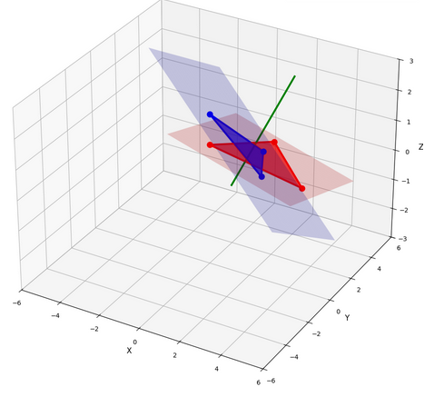
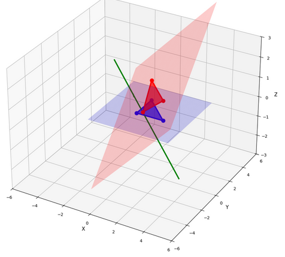
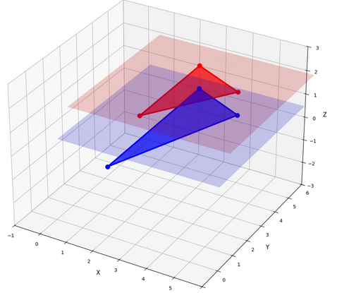
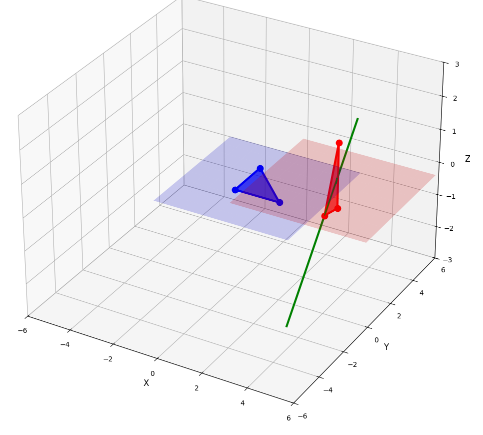
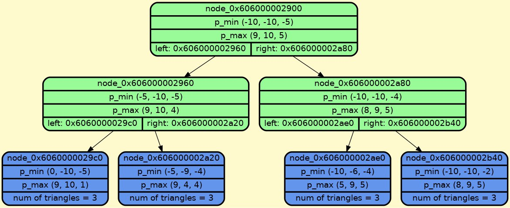

<div align="center">

# LEVEL 1
  # Solution to the triangle intersection problem in C++
  
  
  

</div>

## Other Languages

1. [Russian](/README-R.md)
2. [English](/README.md)

## Content
- [1. Installation and Build](#installation-and-build)
- [2. Introduction (First Level)](#introduction-first-level)
- [3. Implementation of algorithm](#implementation-of-algorithm)
- [4. Data structure for acceleration](#data-structure-for-acceleration)
- [5. Requirements](#requirements)
- [6. Project structure](#project-structure)
- [7. Project Creators](#project-creators)

## Installation and Build:

To install, compile, and run enter:
```bash
git clone https://github.com/BulgakovDmitry/3D_triangles
cd 3D_triangles
cmake -S . -B build -DCMAKE_BUILD_TYPE=Release
cd build
cmake --build .
./3D_triangles
```
To run unit tests, enter:
```bash
ctest
```
Or without ctest:
```bash
cmake --build . --target unit
```
Or in more detail:
```bash
ctest -L intersection
ctest -L primitives
ctest -L BVH
```

To run end_to_end tests, enter:
```bash
cmake --build . --target end_to_end
```

If you want a debug build, enter:
```bash
cmake -S . -B build -DCMAKE_BUILD_TYPE=Debug
cd build
cmake --build .
./3D_triangles
```

## Introduction (First Level)
This `C++` project implements a program for working with triangles in three-dimensional space. Its core functionality includes robust algorithms for calculating geometric properties and detecting intersections between triangles.

The development of such geometric processing tools is highly prospective, as they form the foundational layer for a wide range of critical applications. These include collision detection in physics engines for video games and simulations, 3D modeling and computer-aided design (`CAD`) software, ray tracing for computer graphics, and even pathfinding in robotics. Efficient and accurate triangle manipulation is, therefore, essential for advancements in these technologically significant fields.

## Implementation of algorithm
### Step 1: Testing Triangle `T1` against Plane `π₂`
Three `orient_3d` predicates are computed to determine the position of the vertices of `T1` relative to the plane `π₂` defined by `T2`. If all vertices lie strictly on the same side of the plane, no intersection exists. If all three predicates return zero, the triangles are coplanar, and the problem is reduced to a `2D` intersection test. Otherwise, the algorithm proceeds.

<table>
  <tr>
    <td align="center">
      
      <br>
      <em>Fig. 1. Standard case of intersection of triangles on the line of intersection of planes. The line of intersection of the planes is marked in green, the areas in which the corresponding triangles lie are marked in blue and red.</em>
    </td>
    <td align="center">
      
      <br>
      <em>Fig. 2. Intersection of triangles in one vertex. The line of intersection of the planes is marked in green, the areas in which the corresponding triangles lie are marked in blue and red.</em>
    </td>
  </tr>
</table>

<table>
  <tr>
    <td align="center">
      
      <br>
      <em>Fig. 3. Parallel case, there is no intersection here. The areas in which the corresponding triangles lie are marked in blue and red</em>
    </td>
    <td align="center">
      
      <br>
      <em>Fig. 4. There is no intersection here. The red triangle intersects the plane of the blue at one vertex.</em>
    </td>
  </tr>
</table>


### Step 2: Testing Triangle `T2` against Plane `π₁`
Similarly, three `orient_3d` predicates are computed to determine the position of `T2's` vertices relative to the plane `π₁` of `T1`. If all vertices are on one side, there is no intersection. If all predicates are zero, the triangles are coplanar (`2D case`). If this step is passed, both triangles are guaranteed to intersect the line of intersection (`L`) of their respective planes.

### Step 3: Canonical Vertex Ordering
The vertices of each triangle are permuted to achieve a canonical configuration. For each triangle, the goal is to have one vertex (P) on one side of the other triangle's plane, and the other two vertices (`Q` and `R`) on the opposite side. This ensures that edges `P-Q` and `P-R` intersect the plane, defining a segment on the line `L`.

### Step 4: Interval Overlap Test via Predicates
The overlap of the two segments on line `L` is determined by evaluating two orientation predicates: `orient_3d(P₁, Q₁, P₂, Q₂) > 0` and `orient_3d(P₁, R₁, R₂, P₂) > 0`. If both conditions are true, the segments overlap, indicating that the triangles intersect.

### Function to check intersect of triangles
The algorithm for checking the intersection of triangles in three-dimensional space is implemented as follows:
<details>
<summary>Click to show/hide code</summary>

```cpp
inline bool intersect(const Triangle &first, const Triangle &second) {
    if (first.get_type() == TypeTriangle::point)
        return point_inside_triangle(second, first.get_vertices()[0]);
    if (second.get_type() == TypeTriangle::point)
        return point_inside_triangle(first, second.get_vertices()[0]);
    if (first.get_type() == TypeTriangle::interval)
        return segment_intersect_triangle(/*triangle=*/second, /*interval=*/first);
    if (second.get_type() == TypeTriangle::interval)
        return segment_intersect_triangle(/*triangle=*/first, /*interval=*/second);

    Sign relative_positions = check_relative_positions(first, second);

    if (relative_positions == Sign::pozitive || relative_positions == Sign::negative)
        return false;

    if (relative_positions == Sign::common_plane)

        return intersection_2d::intersect_2d(first, second); // 2d case

    if (relative_positions == Sign::common_vertice_other_poz_or_neg)
        return intersect_one_vertice_in_plane(first, second);

    auto canon_main = canonicalize_triangle(first, second);
    auto canon_ref = canonicalize_triangle(second, first);

    return check_segments_intersect(canon_main, canon_ref);
}
```
</details>

## Data structure for acceleration
To speed up the project, a BVH class was implemented, which is a binary tree.
At the lowest levels of this tree, there are 1-3 triangles enclosed in a bounding box.
For a clear demonstration and to obtain complete information about these boxes (including for convenient debugging), a graphical dump was implemented, an example of which is shown below:
<div align="center">
  
</div>

<div align="center">


# LEVEL 2
  # OpenGL visualization of triangle intersections
  
  
  

</div>

## Content
- [1. Installation and Build](#installation-and-build)
- [2. Introduction (Second Level)](#introduction-second-level)
- [3. Implementation of graphics](#implementation-of-graphics)
- [5. Requirements](#requirements)
- [6. Project structure](#project-structure)
- [7. Project Creators](#project-creators)

## Introduction (Second Level)

## Implementation of graphics

## Requirements
- C++23 or later
- CMake 3.20+
- Google Test (for testing)
- Graphviz (optional, for visualization)

## Project structure
```tree
3D_triangles/
├── CMakeLists.txt
├── include
|   ├── BVH
|   |  ├── AABB.hpp
|   |  ├── BVH.hpp
|   |  └── node.hpp
|   ├── primitives
|   |  ├── point.hpp
|   |  ├── vector.hpp
|   |  ├── triangle
|   |  └── line.hpp
|   ├── common
|   |  └── cmp.hpp
|   ├── intersection
|   |  ├── point_to_segment.hpp
|   |  ├── point_to_triangle.hpp
|   |  ├── segment_to_segment.hpp
|   |  ├── triangle_to_triangle_2d.hpp
|   |  └── triangle_to_triangle.hpp
│   └── driver.hpp
├── src
|   ├── driver.cpp
|   ├── BVH.cpp
│   └── main.cpp
├── dump
|   ├── graph_dump.gv
│   └── graph_dump.png
└── tests
    ├── CMakeLists.txt
    ├── end_to_end/
    |   └──...
    ├── BVH/
    |   └──...
    ├── primitives/
    |   └──...
    └── intersection/
        └──...
```

## Project Creators

<div align="center">

  <a href="https://github.com/RTCupid">
    
  </a>
  <a href="https://github.com/BulgakovDmitry">
    
  </a>
  <br>
  <a href="https://github.com/RTCupid"><strong>@RTCupid, </strong></a>
  <a href="https://github.com/BulgakovDmitry"><strong>@BulgakovDmitry</strong></a>
  <br>
</div>
